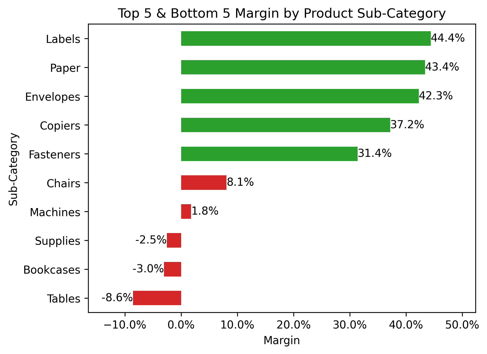
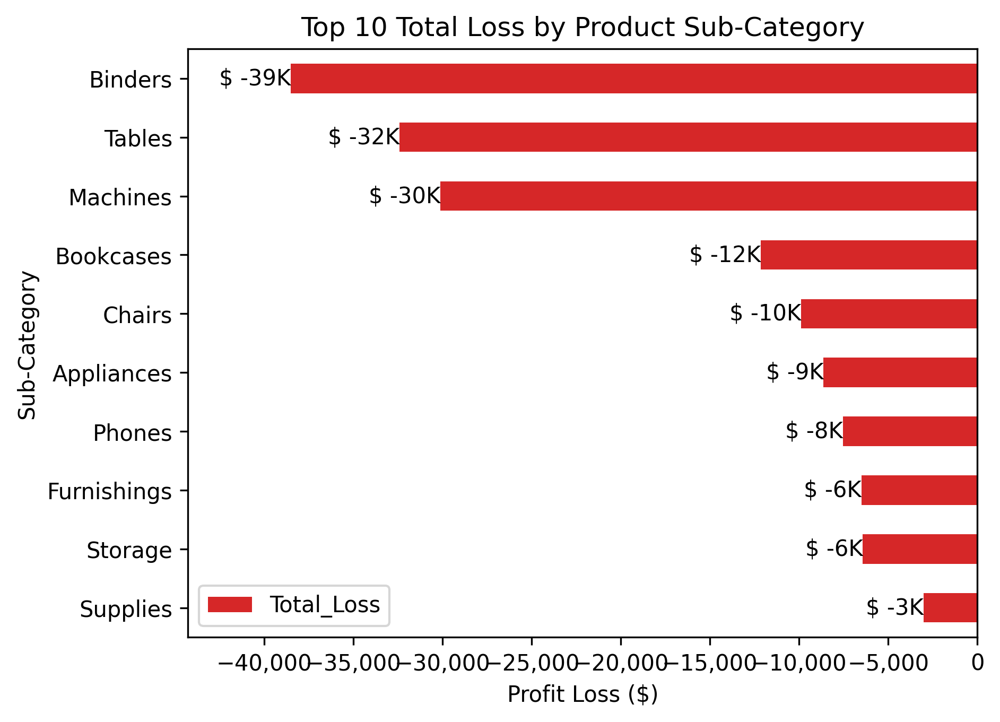
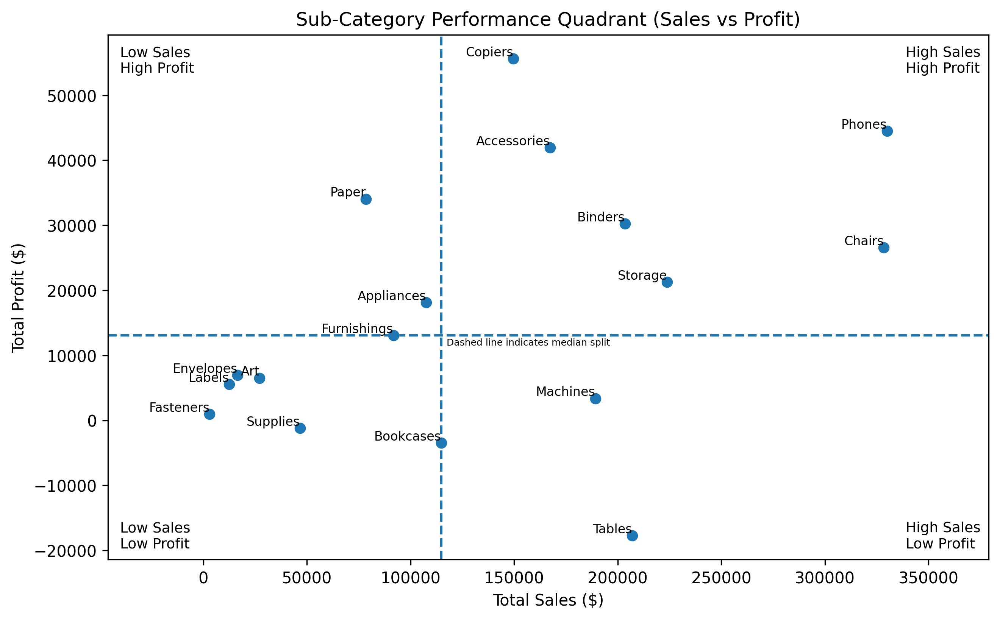

# Superstore Financial Analysis

## 📌 Overview
Financial analysis of retail superstore sales to identify profit drivers, loss segments, discount impact, and product portfolio structure using Python.
---

## Business Problem
The company generates strong sales but faces inconsistent profitability and recurring losses across certain products and transactions. High discounting and product portfolio imbalance may be eroding margins. However, there is no clear financial analysis identifying which products drive profit or loss, how discounts affect profitability, and how financial performance evolves over time.
---

## Objectives
- Evaluate sales, profit, and margin across key business dimensions
- Assess the impact of discounts on profitability
- Identify patterns in loss-making transactions
- Analyze product portfolio performance (sales vs. profit)
- Examine sales and profit trends over time
---

## Dataset
- Source: Superstore Sales (Kaggle)
- Rows: 9994 Transactions
- Features:
  - IDs (2 Features: Row ID, Order ID)
  - Dates Jan 2011 - Dec 2014 (2 Features: Order Date, Ship Date) 
  - Ship Mode
  - Customers (2 Features: Customer ID, Customer Name)
  - Segment
  - Location (5 Features: Country, City, State, Postal Code, Region)
  - Products (4 Features: Product ID, Category, Sub-Category, Product Name)
  - Sales
  - Quantity
  - Discount
  - Profit
---

## Methodology
### 1. Data Preparation
- Checked missing values
- Checked data inconsistency
- Checked Duplicate Data

### 2. Exploratory Data Analysis
- Sales, Profit, Margin
- Discount
- Loss Analysis
- Product Portfolio
- Financial Trend Over time

## 📈 Results & Visualizations

### Top and Bottom 5 Margins by Products Sub-Category


### Top Total Loss by Products Sub-Category


### Product Portfolio


Additional visualizations are available in the notebook.
---

## 💡 Key Insights
- High sales volume does not necessarily translate into profitability, particularly in Tables and Bookcases
- Higher discount levels are associated with lower profit and increased losses
- Losses are concentrated in a small number of sub-categories, with Binders, tables, and Machines contributing the majority (~65% of losses)
- The product portfolio shows imbalance, where some high-revenue segments operate at negative margins
- Revenue growth over time is not consistently matched by profit growth, indicating margin pressure
---

## 🛠 Tools & Technologies
- Python
- Pandas
- Matplotlib
- Seaborn
- Rapidfuzz
- Jupyter Notebook

  ## How to Run
  1. Clone this repo
     ```bash
     - git clone https://github.com/Rizki-Damopolii-DA/superstore-financial-analysis.git
     - cd superstore-financial-analysis
  3. Install Dependencies
     ```bash
     - pip install -r requirements.txt
  5. Launch Jupyter Notebook
  6. Open the Notebook -> Superstore Sales Analysis.ipynb
  7. Run all cells to reproduce the exploratory analysis and visualizations.
